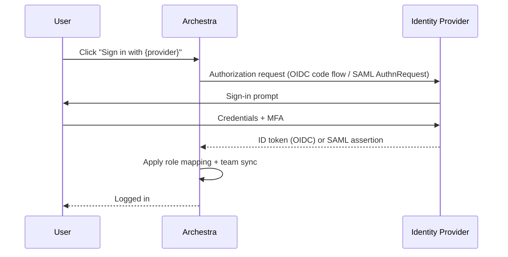

Single Sign-On (SSO) lets users sign in to Archestra with the identity they already have at work — Microsoft, Okta, Google, GitHub, GitLab, or any OIDC/SAML provider — instead of managing a separate username and password. All SSO providers are configured from **Settings > Identity Providers**. Once a provider is enabled, a sign-in button for it appears on the Archestra login page and users are provisioned automatically on first login.

## How SSO Sign-In Works

When a user clicks an SSO button, Archestra redirects them to the identity provider, which authenticates them and returns a token or assertion. Archestra then evaluates any configured role mapping and team sync rules before provisioning or logging in the user.



## Supported Protocols

| Protocol | Use it for |
|---|---|
| **OIDC** (OpenID Connect) | Microsoft Entra ID, Okta, Google, GitHub, GitLab, Auth0, Keycloak, any modern OAuth 2.0 + OIDC provider |
| **SAML 2.0** | Older enterprise IdPs that don't speak OIDC, or organizations standardized on SAML |

OIDC is the default choice for new setups. SAML is supported for compliance-driven environments.

## Callback URLs

Each protocol uses a different callback URL format. The `{ProviderId}` segment is **case-sensitive** and must match the provider ID configured in Archestra exactly (for example `Okta`, `EntraID`, `Google`).

<Tabs>
  <Tab title="OIDC">
    **Production:**
    ```
    https://your-archestra-domain.com/api/auth/sso/callback/{ProviderId}
    ```

    **Local development:**
    ```
    http://localhost:3000/api/auth/sso/callback/{ProviderId}
    ```
  </Tab>
  <Tab title="SAML (ACS URL)">
    **Production:**
    ```
    https://your-archestra-domain.com/api/auth/sso/saml2/sp/acs/{ProviderId}
    ```

    **Local development:**
    ```
    http://localhost:3000/api/auth/sso/saml2/sp/acs/{ProviderId}
    ```
  </Tab>
</Tabs>

## Supported Providers

| Provider | Protocol | SSO Sign-In | Role Mapping | Team Sync | Token Exchange |
|---|---|---|---|---|---|
| **Microsoft Entra ID** | OIDC | Yes | Yes | Yes (`groups` claim) | Entra OBO |
| **Okta** | OIDC | Yes | Yes | Yes | Okta-managed (private key JWT) |
| **Google** | OIDC | Yes | Yes | Yes | RFC 8693 |
| **GitHub** | OIDC | Yes | Yes | Yes | RFC 8693 |
| **GitLab** | OIDC | Yes | Yes | Yes | RFC 8693 |
| **Generic OIDC** | OIDC | Yes | Yes | Yes | RFC 8693 (or Okta/Entra if issuer matches) |
| **Generic SAML** | SAML 2.0 | Yes | Yes | Yes | Not supported |

## Allowed Email Domains

The **Allowed Email Domains** field is an optional Archestra-side sign-in boundary. When configured, users can only authenticate with that provider when their email matches one of the configured domains. Use comma-separated values for multi-domain SSO:

```
company.com, subsidiary.com
```

Subdomains are included automatically — `engineering.company.com` matches `company.com`.

## User Provisioning

When a user authenticates via SSO for the first time:

1. A new user account is created with the email and name from the identity provider
2. The user's role is determined by role mapping rules (if configured), otherwise the provider's default role (or **Member**)
3. The user is added to the organization
4. A session is created and the user is logged in

Role mapping rules are evaluated on **each login**, so role changes in the IdP take effect on next sign-in. If a user already has an Archestra account with the same email, SSO automatically links to it.

## Disabling Basic Authentication

Once SSO is confirmed working, you can enforce SSO-only login by disabling the username/password form.

```bash
ARCHESTRA_AUTH_DISABLE_BASIC_AUTH=true
```

<Warning>
Verify at least one SSO provider is working before disabling basic auth, or you and your admins will be locked out. Restart the backend after setting this variable.
</Warning>

## Disabling User Invitations

For organizations relying on SSO auto-provisioning, you can disable the manual invitation system entirely. This hides the invitation UI and blocks invitation API endpoints.

```bash
ARCHESTRA_AUTH_DISABLE_INVITATIONS=true
```

## Role Mapping

Role mapping lets you automatically assign Archestra roles based on user attributes from your identity provider — no manual role assignment required after initial provisioning.

### How It Works

Archestra evaluates Handlebars templates against the claims in the user's ID token (OIDC) or SAML assertion. Rules are evaluated **in order** — the first matching rule wins.

<Steps>
  <Step title="Open the SSO provider">
    In **Settings > Identity Providers**, create or edit an SSO provider and expand the **Role Mapping** section.
  </Step>
  <Step title="Add mapping rules">
    Each rule has a **Handlebars Template** (evaluated against ID token claims) and an **Archestra Role** to assign when the template matches.
  </Step>
  <Step title="Set a default role">
    Choose the role assigned when no rules match. Defaults to `member` if not specified.
  </Step>
  <Step title="Configure strict mode (optional)">
    When **Strict Mode** is enabled, users who don't match any rule are denied login entirely rather than assigned the default role.
  </Step>
</Steps>

### Handlebars Helpers

| Helper | Description |
|---|---|
| `includes` | Check if an array includes a value (case-insensitive) |
| `equals` | Check if two values are equal (case-insensitive for strings) |
| `contains` | Check if a string contains a substring (case-insensitive) |
| `and` | Logical AND — true if all values are truthy |
| `or` | Logical OR — true if any value is truthy |
| `exists` | True if the value is not null/undefined |
| `notEquals` | Check if two values are not equal |

### Template Examples

```handlebars
{{! Match if "admins" is in the groups array }}
{{#includes groups "admins"}}true{{/includes}}

{{! Match if role claim equals "administrator" }}
{{#equals role "administrator"}}true{{/equals}}

{{! Match if "platform-admin" is in a roles array }}
{{#each roles}}{{#equals this "platform-admin"}}true{{/equals}}{{/each}}

{{! Parse a JSON string claim (e.g., Okta) then check role name }}
{{#with (json roles)}}{{#each this}}{{#equals this.name "archestra-admin"}}true{{/equals}}{{/each}}{{/with}}
```

<Note>
For OIDC providers, group-based rules only work if the ID token contains the group claim. Many IdPs don't include groups with the default `openid`, `email`, and `profile` scopes — add the provider's groups scope and configure the IdP to emit that claim.
</Note>

### Skip Role Sync

Enable **Skip Role Sync** to set a user's role only on their first login. Subsequent logins won't update the role, even if IdP attributes change — useful when administrators need to manually adjust roles after initial provisioning.

## Team Sync

Team sync automatically adds and removes users from Archestra teams based on their IdP group memberships. Members added manually to a team are **never** removed by sync.

### How It Works

1. Admin links an Archestra team to one or more external IdP group identifiers
2. On each SSO login, Archestra extracts the user's group memberships from the token
3. Users in a linked group are added to the corresponding team; users no longer in any linked group are removed (if they were added via sync)

### Default Group Extraction

If no custom template is configured, Archestra checks these claim names in order:

```
groups, group, memberOf, member_of, roles, role, teams, team
```

The first claim that contains non-empty group data is used.

### Custom Handlebars Templates

| Template | Input Format |
|---|---|
| `{{#each groups}}{{this}},{{/each}}` | Flat array: `["admin", "users"]` |
| `{{#each roles}}{{this.name}},{{/each}}` | Array of objects: `[{name: "admin"}]` |
| `{{{json (pluck roles "name")}}}` | Array of objects, JSON output |
| `{{#with (json roles)}}{{#each this}}{{this.name}},{{/each}}{{/with}}` | JSON string claim |

### Linking Teams to Groups

<Steps>
  <Step title="Navigate to Settings > Teams">
    Open an existing team or create a new one.
  </Step>
  <Step title="Click the link icon">
    Click **Configure SSO Team Sync** next to the team name.
  </Step>
  <Step title="Enter the external group identifier">
    Enter the group name as extracted by your Handlebars template — for example `dev-team`, an Entra group object ID, or an LDAP DN such as `cn=admins,ou=groups,dc=example,dc=com`.
  </Step>
  <Step title="Save">
    Click **Add** to create the mapping. Repeat for additional groups.
  </Step>
</Steps>

Group matching is **case-insensitive**. A single team can be linked to multiple external groups, and multiple teams can share the same group mapping.

## Provider Setup Walkthroughs

<Tabs>
  <Tab title="Okta">
    This walkthrough configures Okta OIDC sign-in for Archestra. After completing Part 1, users can sign in with Okta. Parts 2–4 optionally layer Okta-managed token exchange for per-user downstream MCP tool calls.

    ### Part 1 — Register the Okta App

    **Recommended: Install from the Okta Integration Network (OIN)**

    Archestra is published in the Okta Integration Network. The OIN flow pre-configures redirect URIs, scopes, and grant types.

    <Steps>
      <Step title="Open the Okta Admin Console">
        Go to **Applications > Applications**, click **Browse App Catalog**, and search for **Archestra**.
      </Step>
      <Step title="Add the integration">
        Click **Add**. In **General Settings**, enter your Archestra hostname **without protocol** — for example `your-archestra-domain.com` (not `https://`).
      </Step>
      <Step title="Assign users or groups">
        Assign the users or groups that should access Archestra.
      </Step>
      <Step title="Copy credentials">
        From the app's **Sign On** tab, copy the **Client ID** and **Client Secret**.
      </Step>
    </Steps>

    <Note>
      Archestra does not support Okta DPoP for SSO clients. In the app's **General > Client Credentials** settings, disable **Require Demonstrating Proof of Possession (DPoP) header in token requests**.
    </Note>

    **Alternative: Manual App Integration**

    If your tenant doesn't have access to the OIN tile:

    1. Go to **Applications > Create App Integration** > **OIDC - OpenID Connect** > **Web Application**
    2. **Sign-in redirect URI:** `https://your-archestra-domain.com/api/auth/sso/callback/Okta` (the `Okta` segment is case-sensitive)
    3. **Sign-out redirect URI:** `https://your-archestra-domain.com/auth/sign-in`
    4. Set **Login initiated by** to **Either Okta or App**
    5. Set **Login flow** to **Redirect to app to initiate login (OIDC Compliant)**
    6. Set **Initiate login URI** to `https://your-archestra-domain.com/auth/sso/Okta`
    7. Keep **Send ID Token directly to app (Okta Simplified)** disabled

    ### Part 2 — Configure SSO in Archestra

    Go to **Settings > Identity Providers** and click **Enable** on the **Okta** card.

    | Field | Value |
    |---|---|
    | **Issuer** | Your Okta org issuer, e.g. `https://your-org.okta.com` |
    | **Client ID** | From Okta's **Sign On** tab |
    | **Client Secret** | From Okta's **Sign On** tab |
    | **Discovery Endpoint** | Leave empty — auto-derived from issuer |

    Click **Create Provider**, then test with a private browser window.

    ### Part 3 — Roles & Team Sync

    For Okta, the most common pattern is mapping the `groups` claim. When using the OIN app, Okta only includes groups whose names start with `Archestra_` in the `groups` claim (e.g., `Archestra_Admin`, `Archestra_Engineering`). Okta can include up to 100 groups.

    In Archestra, use the default group extraction or set the Groups Handlebars Template to:

    ```handlebars
    {{#each groups}}{{this}},{{/each}}
    ```

    See [Role Mapping](#role-mapping) and [Team Sync](#team-sync) above for the full configuration reference.

    ### Part 4 — Token Exchange for Downstream MCP Tools (Optional)

    Token exchange uses the same Okta application as SSO. You'll need to:

    1. Generate a public/private keypair and register the public key under **Public Keys** on the Okta app
    2. Note the **Key ID (kid)**
    3. Enable the `urn:ietf:params:oauth:grant-type:token-exchange` grant type on the app
    4. Configure the authorization server policies to allow the exchange

    Then reopen the Okta provider in **Settings > Identity Providers** and expand **Enterprise-Managed Credentials**:

    | Field | Value |
    |---|---|
    | **Exchange Token Endpoint** | `https://your-org.okta.com/oauth2/v1/token` |
    | **Exchange Client Authentication** | Private key JWT |
    | **Signing Key ID** | The `kid` of the registered public key |
    | **User Token To Exchange** | ID token |

    Follow [Okta's AI agent token exchange guide](https://developer.okta.com/docs/guides/ai-agent-token-exchange/authserver/main/) for the full Admin Console steps.

    ### Troubleshooting Okta

    - **App tile opens the wrong place** — The hostname in Okta must not include `https://` or a path; enter only the bare hostname.
    - **Manual tile doesn't start SSO** — Set **Login initiated by** to **Either Okta or App**, **Login flow** to **Redirect to app to initiate login**, and **Initiate login URI** to `https://your-archestra-domain.com/auth/sso/Okta`.
    - **`invalid_dpop_proof` error** — Disable DPoP in the Okta app's security settings.
    - **Login fails after redirect** — The Okta **Sign-in redirect URI** must exactly match the Archestra callback URL, including the case-sensitive `Okta` segment.
  </Tab>
  <Tab title="Microsoft Entra ID">
    This walkthrough configures Microsoft Entra ID OIDC sign-in. Parts 1–3 cover SSO. Parts 4–6 add On-Behalf-Of (OBO) token exchange so agents can call Entra-protected APIs as the signed-in user.

    ### Part 1 — Register the Entra App

    <Steps>
      <Step title="Create the app registration">
        In **Microsoft Entra ID > App registrations > + New registration**, set:
        - **Name:** `Archestra`
        - **Supported account types:** *Accounts in this organizational directory only*
        - **Redirect URI:** *Web* → `https://your-archestra-domain.com/api/auth/sso/callback/EntraID`

        Click **Register**.
      </Step>
      <Step title="Copy identifiers">
        From the **Overview** page, copy the **Application (client) ID** and **Directory (tenant) ID**.
      </Step>
      <Step title="Create a client secret">
        Go to **Certificates & secrets > Client secrets > + New client secret**. Copy the **Value immediately** — it disappears after page reload.
      </Step>
      <Step title="Grant Graph API permissions">
        Go to **API permissions > + Add a permission > Microsoft Graph > Delegated permissions**, check `User.Read`, then click **Grant admin consent**.
      </Step>
    </Steps>

    ### Part 2 — Configure SSO in Archestra

    Go to **Settings > Identity Providers** and click **Enable** on the **Microsoft Entra ID** card.

    | Field | Value |
    |---|---|
    | **Tenant ID (in endpoint URLs)** | Replace `{tenant-id}` with your Directory (tenant) ID in all pre-filled fields |
    | **Client ID** | The Application (client) ID |
    | **Client Secret** | The secret Value from the previous step |
    | **Scopes** | `openid`, `profile`, `email` (add `offline_access` to enable token refresh) |
    | **Allowed Email Domains** | Optional — e.g. `acme.com, acme-subsidiary.com` |

    Click **Create Provider** and test in a private browser window.

    ### Part 3 — Roles & Team Sync

    For Entra ID, the most common pattern is mapping the `groups` claim. Enable the **Groups claim** in the Entra app's **Token configuration** blade (set to `Group ID` for object IDs, or `sAMAccountName` for on-prem-synced names). Entra does not require an additional OAuth scope for group claims.

    In Archestra, use the default group extraction or set the Groups Handlebars Template to:

    ```handlebars
    {{#each groups}}{{this}},{{/each}}
    ```

    Link Archestra teams to Entra group object IDs (or names) under **Settings > Teams > link icon**.

    ### Part 4 — Configure OBO (Optional)

    OBO requires the Entra app to expose a scope and authorize itself as a client.

    **Expose an API:**

    1. **Expose an API > Add** next to Application ID URI — accept the default `api://<client-id>` and save
    2. **+ Add a scope** — name it `access_as_user`, set Who can consent to *Admins and users*, and enable it

    **Allow the app to request tokens for itself:**

    1. Under **Authorized client applications**, add a client application using the **same Client ID**
    2. Check the `api://<client-id>/access_as_user` scope

    **Add downstream API permissions** (e.g., `Mail.Read`, `Calendars.Read`, `Files.Read`) and click **Grant admin consent**.

    ### Part 5 — Configure OBO in Archestra

    Reopen the Entra ID provider and expand **Enterprise-Managed Credentials**:

    | Field | Value |
    |---|---|
    | **Scopes** | `openid`, `profile`, `email`, `offline_access`, `api://<archestra-app-client-id>/access_as_user` |
    | **Exchange Token Endpoint** | `https://login.microsoftonline.com/<TENANT_ID>/oauth2/v2.0/token` |
    | **Exchange Client Authentication** | Client secret POST |
    | **Exchange Client Secret** | Same secret Value from Part 1 |
    | **User Token To Exchange** | Access token |

    ### Part 6 — Connect an MCP Server

    Open the MCP catalog item and scroll to **Multitenant Authorization**. Select **Identity Provider Token Exchange**, choose the Entra provider, then fill in:

    | Field | Value |
    |---|---|
    | **Requested Credential** | Bearer token |
    | **Injection Mode** | Authorization: Bearer |
    | **Managed Resource Identifier** | e.g. `https://graph.microsoft.com` or `api://<downstream-app-client-id>` |

    Assign tools from this server to an Agent or Gateway using **Resolve at call time** as the credential resolution type.

    <Note>
      Local MCP servers must use the **streamable-http** transport — stdio servers don't support per-request token exchange.
    </Note>

    ### Troubleshooting Entra ID

    - **`state_mismatch` error** — Third-party cookies must be enabled; the callback URL must exactly match, including the case-sensitive `EntraID` segment.
    - **`missing_user_info` error** — The IdP didn't return required user attributes. Verify the `User.Read` permission is granted and admin consent has been provided.
    - **`signature_validation_failed` (SAML)** — The IdP certificate in Archestra must match the current signing certificate. Re-download the IdP metadata if certificates have rotated.
  </Tab>
  <Tab title="Google">
    <Steps>
      <Step title="Create OAuth credentials">
        In [Google Cloud Console](https://console.cloud.google.com/), navigate to **APIs & Services > Credentials > Create an OAuth 2.0 Client ID** (Web application).
      </Step>
      <Step title="Add the callback URL">
        Add `https://your-domain.com/api/auth/sso/callback/Google` as an authorized redirect URI.
      </Step>
      <Step title="Copy credentials">
        Copy the **Client ID** and **Client Secret**.
      </Step>
      <Step title="Enable in Archestra">
        In **Settings > Identity Providers**, click **Enable** on the Google card and paste the credentials and allowed email domains.
      </Step>
    </Steps>

    **Notes:**
    - The discovery endpoint is auto-configured
    - The optional **Hosted Domain Hint** passes Google's `hd` parameter to prefer Workspace account selection. Archestra still enforces **Allowed Email Domains** after Google returns the authenticated email.
  </Tab>
  <Tab title="GitHub">
    <Steps>
      <Step title="Create an OAuth App">
        In [GitHub Developer Settings](https://github.com/settings/developers), go to **New OAuth App** and set the **Authorization callback URL** to `https://your-domain.com/api/auth/sso/callback/GitHub`.
      </Step>
      <Step title="Copy credentials">
        Copy the **Client ID** and generate a **Client Secret**.
      </Step>
      <Step title="Enable in Archestra">
        In **Settings > Identity Providers**, click **Enable** on the GitHub card and paste the credentials.
      </Step>
    </Steps>

    **Notes:**
    - Users must have a **public email** set in their GitHub profile — GitHub's OAuth `/user` endpoint does not expose private emails
    - PKCE is automatically disabled for GitHub (not supported by GitHub)
  </Tab>
  <Tab title="Generic OIDC / SAML">
    **Generic OIDC** (Auth0, Keycloak, custom providers):

    Required fields:
    - **Provider ID** — a unique identifier, e.g. `auth0` or `keycloak`
    - **Issuer** — the OIDC issuer URL
    - **Client ID** and **Client Secret** — from your IdP

    Optional fields:
    - **Discovery Endpoint** — defaults to `{issuer}/.well-known/openid-configuration`
    - **Scopes** — add `offline_access` for token refresh; add the provider's groups scope for role mapping/team sync
    - **PKCE** — enable if your provider requires it
    - **Enable RP-Initiated Logout** — sends `post_logout_redirect_uri` on sign-out (on by default)

    ---

    **Generic SAML 2.0**:

    Required fields:
    - **Provider ID** — a unique identifier, e.g. `okta-saml` or `adfs`
    - **SAML Issuer / Entity ID** — the IdP's entity ID (from IdP metadata)
    - **SSO Entry Point URL** — the IdP's Single Sign-On URL
    - **IdP Certificate** — the X.509 certificate from your IdP

    Optional:
    - **IdP Metadata XML** — full XML metadata document (recommended over individual fields)

    SAML responses must be signed by the IdP. `NameID` format should be `emailAddress`. SAML providers cannot perform downstream token exchange — use OIDC for that.
  </Tab>
</Tabs>

## Troubleshooting

<Accordion title="state_mismatch error">
  Cookies are being blocked, or the callback URL doesn't match.

  - Third-party cookies must be enabled in the browser
  - The callback URL configured at the IdP must exactly match the Archestra callback URL, including the case-sensitive `{ProviderId}` segment
</Accordion>

<Accordion title="missing_user_info error">
  The IdP didn't return the required user attributes. For GitHub, the user must have a **public** email set in their GitHub profile.
</Accordion>

<Accordion title="account not linked error">
  The SSO provider is not trusted for automatic account linking, or the provider returned an email that doesn't match the existing account. Verify the provider is configured in Identity Providers and the user is signing in with the same email as their existing account.
</Accordion>

<Accordion title="account_not_found error (SAML)">
  The SAML assertion didn't contain the required user attributes. Configure your IdP to send:

  - `NameID` in `emailAddress` format
  - `email` attribute
  - `firstName` and `lastName` attributes (recommended)
</Accordion>

<Accordion title="signature_validation_failed error (SAML)">
  The SAML response signature couldn't be verified.

  - The IdP certificate in Archestra must match the current signing certificate from your IdP
  - If using IdP metadata, re-download it (certificates rotate)
</Accordion>
