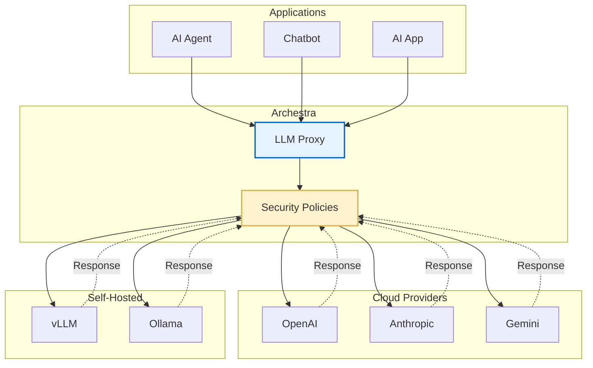

The LLM Proxy is Archestra's security layer that sits between your AI agents, chatbots, and applications and the LLM providers they rely on — OpenAI, Anthropic, Google Gemini, AWS Bedrock, and more. Every request passes through the proxy, where Archestra intercepts and analyzes it, applies security policies, and then forwards it to the upstream provider. Responses travel the same path in reverse, giving you a single control plane for visibility, compliance, and cost management across all LLM traffic.

## How It Works



<CardGroup cols={3}>
  <Card title="Security Policies" icon="shield-halved">
    Every request is evaluated against your configured security and compliance policies before reaching the provider.
  </Card>
  <Card title="Unified Endpoint" icon="plug">
    One proxy URL per provider route replaces direct provider endpoints in your client code, requiring minimal changes.
  </Card>
  <Card title="Full Observability" icon="chart-line">
    All interactions are logged with token counts, costs, latency, and trace attributes for complete audit trails.
  </Card>
</CardGroup>

## Getting Started

<Steps>
  <Step title="Create an LLM Proxy">
    Go to **LLM Proxies** in the Archestra dashboard and create a new proxy. Give it a descriptive name to identify the project or team it serves.
  </Step>
  <Step title="Copy the Provider URL">
    Click the **Connect** icon on the proxy, choose the LLM provider your application uses, and copy the provided proxy URL.
  </Step>
  <Step title="Update Your Application">
    Replace the provider's original endpoint in your application with the Archestra proxy URL. All other request parameters — model name, API key, headers — stay the same.
  </Step>
</Steps>

## OpenAI-Compatible Model Router

The Model Router exposes a single OpenAI-compatible endpoint that can reach models from multiple configured providers. Use it when your application supports the OpenAI API style but you want to route to Anthropic, Gemini, Groq, Bedrock, or other providers without changing client code.

The router accepts OpenAI Responses and Chat Completions requests, resolves provider-qualified model IDs such as `openai:gpt-5.4` or `anthropic:claude-opus-4-6-20250918` to the backing provider, runs the full LLM Proxy security pipeline, and returns a matching OpenAI-format response.

```bash
curl -X POST "https://your-archestra-instance/v1/model-router/{llm-proxy-id}/responses" \
  -H "Authorization: Bearer $MODEL_ROUTER_KEY_OR_APP_TOKEN" \
  -H "Content-Type: application/json" \
  -d '{
    "model": "openai:gpt-5.4",
    "input": "Hello!"
  }'
```

<Note>
  Generic OpenAI-compatible clients should use a virtual key mapped to the providers they need. Backend services and bots should use an LLM OAuth client access token. See [Authentication](/llm-proxy/authentication) for setup details.
</Note>

## Custom Headers

Archestra supports optional custom headers that enrich logs, metrics, and traces without altering the underlying LLM request. All headers are optional and can be combined freely.

| Header | Description | Example Value |
|--------|-------------|---------------|
| `X-Archestra-Agent-Id` | Client-provided identifier for the calling agent or application. Stored with each interaction and included in Prometheus metrics as the `external_agent_id` label. Useful when multiple apps share the same proxy. | `my-chatbot-prod` |
| `X-Archestra-User-Id` | Associates the request with a specific Archestra user. Automatically included when using built-in Archestra Chat. | `123e4567-e89b-12d3-a456-426614174000` |
| `X-Archestra-Session-Id` | Groups related LLM requests into a session — included in trace attributes as `gen_ai.conversation.id`. | `session-abc-123` |
| `X-Archestra-Execution-Id` | Associates the request with a specific execution run. Used for the `agent_executions_total` Prometheus metric. | `exec-run-456` |
| `X-Archestra-Meta` | Composite header combining agent ID, execution ID, and session ID as `<agent-id>/<execution-id>/<session-id>`. Any segment can be empty. Individual headers take precedence. Values must not contain `/`. | `my-agent/exec-123/session-456` |

### Usage Examples

<CodeGroup>
  ```bash Individual Headers
  curl -X POST "https://your-archestra-instance/v1/openai/chat/completions" \
    -H "Authorization: Bearer $OPENAI_API_KEY" \
    -H "X-Archestra-Agent-Id: my-chatbot-prod" \
    -H "X-Archestra-Session-Id: session-abc-123" \
    -H "Content-Type: application/json" \
    -d '{
      "model": "gpt-4",
      "messages": [{"role": "user", "content": "Hello!"}]
    }'
  ```

  ```bash Composite Meta Header
  curl -X POST "https://your-archestra-instance/v1/openai/chat/completions" \
    -H "Authorization: Bearer $OPENAI_API_KEY" \
    -H "X-Archestra-Meta: my-chatbot-prod//session-abc-123" \
    -H "Content-Type: application/json" \
    -d '{
      "model": "gpt-4",
      "messages": [{"role": "user", "content": "Hello!"}]
    }'
  ```
</CodeGroup>

<Tip>
  The `X-Archestra-Meta` header is useful for brevity when you want to set all three identifiers in one header. Leave a segment empty with consecutive slashes if you only need some fields, as shown above (agent ID and session ID, no execution ID).
</Tip>

## Authentication

The LLM Proxy supports direct provider API keys, virtual API keys, LLM OAuth client access tokens, and JWKS via an external identity provider. See [Authentication](/llm-proxy/authentication) for full details on each method and when to use them.

## Supported Providers

Archestra supports OpenAI, Anthropic, Google Gemini and Vertex AI, Azure AI Foundry, AWS Bedrock, Groq, Mistral, xAI, OpenRouter, Cerebras, Cohere, DeepSeek, MiniMax, ZhipuAI, Perplexity, vLLM, and Ollama. See [Supported Providers](/llm-proxy/supported-providers) for connection details and setup instructions for each provider.
