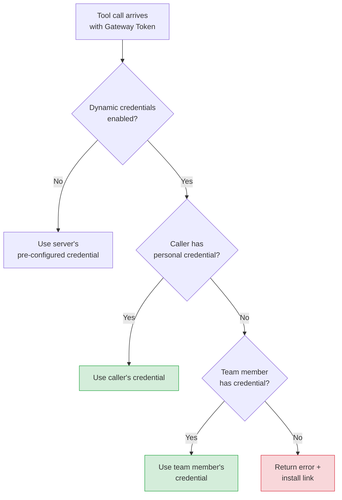

MCP authentication in Archestra operates across two independent layers: the client-facing gateway layer and the upstream MCP server layer. This separation matters because the MCP client should not need to know how every upstream system is authenticated. Cursor, Claude Desktop, Copilot CLI, Open WebUI, or a custom agent authenticates once to an MCP Gateway. Archestra then decides which installed MCP server connection and which upstream credential should be used for each tool call — meaning one gateway can expose tools backed by different credential models simultaneously.

The two layers are:

- **Gateway authentication** — how a client proves it can call `POST /v1/mcp/<gateway-id>`
- **Upstream MCP server authentication** — how Archestra authenticates to the MCP server or external system behind that gateway when a tool actually runs

Clients only send the gateway-facing token. Archestra resolves upstream MCP server authentication separately at execution time, using the caller identity, the gateway or Agent tool assignment, and the installed MCP server credential configuration.

## Gateway Authentication

The MCP Gateway supports four client authentication paths.

<Tabs>
  <Tab title="OAuth 2.1">
    MCP-native clients such as Claude Desktop, Cursor, Copilot CLI, and Open WebUI authenticate automatically using the [MCP Authorization spec](https://modelcontextprotocol.io/specification/2025-11-25/basic/authorization). The gateway acts as both the resource server and the authorization server.

    Supported flows:
    - **Authorization Code + PKCE** — standard browser-based flow with user login and consent
    - **DCR (RFC 7591)** — dynamic client registration at `POST /api/auth/oauth2/register`
    - **CIMD** — clients use an HTTPS URL as their `client_id`; the gateway fetches the client metadata document directly

    Discovery endpoints exposed automatically:
    - `/.well-known/oauth-protected-resource` (RFC 9728)
    - `/.well-known/oauth-authorization-server` (RFC 8414)

    The default access token lifetime is 1 year, reducing unnecessary reconnects for desktop apps. Admins can change this in **Settings > Organization > Auth**. The setting applies to newly issued tokens organization-wide.
  </Tab>
  <Tab title="ID-JAG">
    This option implements the MCP [Enterprise-Managed Authorization](https://modelcontextprotocol.io/extensions/auth/enterprise-managed-authorization) extension using an Identity Assertion JWT Authorization Grant (ID-JAG). It is designed for organizations where a corporate IdP already signs users into MCP clients.

    **Flow:**
    <Steps>
      <Step title="User Signs In">The user signs in to the MCP client with the enterprise IdP.</Step>
      <Step title="Exchange for ID-JAG">The MCP client exchanges the identity assertion with the IdP for an ID-JAG.</Step>
      <Step title="Exchange with Archestra">The MCP client sends the ID-JAG to `POST /api/auth/oauth2/token` using `grant_type=urn:ietf:params:oauth:grant-type:jwt-bearer`.</Step>
      <Step title="Receive MCP Access Token">Archestra validates the ID-JAG and returns an MCP access token scoped to the target gateway.</Step>
      <Step title="Call the Gateway">The MCP client calls the gateway using the Archestra-issued MCP access token.</Step>
    </Steps>

    **Requirements:**
    - The gateway must be linked to an **OIDC** Identity Provider in Archestra
    - The ID-JAG must be a JWT with header `typ=oauth-id-jag+jwt`
    - The ID-JAG `aud` claim must match Archestra's OAuth issuer
    - The ID-JAG `resource` claim must point to `/v1/mcp/<gateway-id>`
    - The ID-JAG `client_id` must match the authenticated MCP client
    - The ID-JAG `scope` must include `mcp`
    - The ID-JAG should include an `email` claim matching an existing Archestra user

    Archestra binds the issued token to the specific gateway in the `resource` claim, so the token cannot be replayed against a different gateway.
  </Tab>
  <Tab title="JWKS">
    Clients send an external IdP JWT directly to the gateway. Archestra validates it against the IdP's JWKS endpoint and matches the caller to an Archestra user account based on the `email` claim.

    **How it works:**
    <Steps>
      <Step title="Configure IdP">Admin configures an OIDC Identity Provider in **Settings > Identity Providers** and links it to the gateway.</Step>
      <Step title="Client Obtains JWT">External MCP client obtains a JWT from the IdP via client credentials flow or user login.</Step>
      <Step title="Client Calls Gateway">Client sends `Authorization: Bearer <jwt>` to the gateway.</Step>
      <Step title="Gateway Validates">Gateway fetches the JWKS URL from the IdP's OIDC discovery endpoint and validates the JWT signature, issuer, audience, and expiration.</Step>
      <Step title="Credential Resolution">Gateway extracts the `email` claim, matches it to an Archestra user, and resolves upstream credentials.</Step>
    </Steps>

    **Requirements:**
    - The IdP must be an **OIDC** provider with a standard `.well-known/openid-configuration` endpoint
    - JWT `iss` must match the IdP's issuer URL
    - JWT `aud` must match the IdP's client ID (if configured)
    - JWT must contain an `email` claim matching an existing Archestra user
    - The user must have `profile:admin` permission or be a member of at least one team associated with the gateway

    When no upstream credentials are configured, the gateway propagates the original JWT as `Authorization: Bearer` for end-to-end identity propagation to upstream servers.
  </Tab>
  <Tab title="Bearer Token">
    Direct integrations send `Authorization: Bearer arch_<token>`. Tokens are managed in **Settings > Tokens** and can be scoped to a specific user, team, or organization.

    For per-user access to downstream systems, use **personal user tokens**. Team and organization tokens can authenticate to the gateway but do not identify a specific user strongly enough for Archestra to broker per-user downstream credentials.

    Bearer tokens are not enterprise assertions by themselves. If Archestra also needs to exchange the matched user's IdP token for a downstream credential, it must have a usable IdP token for that user.
  </Tab>
</Tabs>

## ID-JAG vs. JWKS

ID-JAG and JWKS both rely on enterprise-issued JWTs, but they solve different problems.

| | ID-JAG | JWKS |
|---|---|---|
| **What the client sends** | Enterprise assertion → exchanged for Archestra MCP token | Enterprise JWT sent directly |
| **Token at the gateway** | Archestra-issued MCP access token | External IdP JWT |
| **Gateway token bound to** | Specific MCP Gateway resource | Not bound |
| **Use when** | Client uses the ID-JAG token exchange flow; you want Archestra to mint its own MCP token | Client already has a bearer JWT; you want direct validation and JWT propagation |

## Upstream MCP Server Authentication

MCP servers that connect to external services need their own credentials. Archestra manages this with a two-token model: the **Gateway Token** authenticates the client to Archestra; the **Upstream MCP Server Token** authenticates Archestra to the upstream server. The client only ever sends the gateway token — Archestra resolves the upstream token behind the scenes.

There are five types of upstream credentials:

<Accordion title="Static Secrets">
  API keys or personal access tokens set once at install time and used for all requests. When a tool assignment is pinned to a specific installed connection, Archestra validates the connection scope:

  - **Team-installed connection** — can only be assigned to a team-scoped Agent or MCP Gateway that includes that same team
  - **Personal connection** — can only be assigned to a resource the connection owner could access directly

  The primary credential is injected as `Authorization`, `Authorization: Bearer`, or a custom header such as `x-api-key`, depending on what the upstream server expects.
</Accordion>

<Accordion title="OAuth Tokens (Per-User)">
  Obtained by running an OAuth flow against the upstream provider during installation. Archestra stores both the access token and refresh token. When the upstream server returns a 401, Archestra uses the stored refresh token to obtain a new access token and retries the request automatically. Refresh failures are tracked per server and visible in the MCP server status page.

  If the MCP server URL is different from the OAuth issuer or metadata host, configure explicit OAuth overrides in the catalog item — Archestra supports a separate authorization server URL, direct well-known metadata URLs, or direct authorization and token endpoints.
</Accordion>

<Accordion title="OAuth Client Credentials (Shared)">
  Use `grant_type=client_credentials` for shared machine-to-machine access. Archestra stores the `client_id`, `client_secret`, and optional `audience`, exchanges them for a short-lived bearer token at call time, and reuses the token until the refresh window is reached. Install one connection per team or shared scope.
</Accordion>

<Accordion title="Identity Provider Token Exchange">
  Archestra exchanges the caller's IdP token at tool-call time using one of three strategies:

  - **RFC 8693 token exchange** — Archestra exchanges the user's token at the IdP token endpoint and injects the returned bearer token
  - **Okta managed credential exchange** — Archestra exchanges the user's token for an Okta-managed credential or secret
  - **Microsoft Entra on-behalf-of (OBO)** — Archestra exchanges the signed-in user's Entra access token for the downstream API token

  Configure all three of the following to enable this mode:
  1. **Identity Provider** — fill in the **Enterprise-Managed Credentials** section in **Settings > Identity Providers**
  2. **MCP catalog item** — choose **Identity Provider Token Exchange** in the server's multitenant authorization settings
  3. **Tool assignment** — select **Resolve at call time**

  Token Exchange Configuration fields on the catalog item:

  | Field | Purpose |
  |---|---|
  | **Requested Credential** | Type of value to request — bearer token, secret, ID-JAG, service account, or opaque JSON |
  | **Injection Mode** | How Archestra sends the value upstream — `Authorization: Bearer`, raw `Authorization`, or custom header |
  | **Managed Resource Identifier** | Audience or resource ID that tells the IdP which downstream token to mint |
  | **External Provider Alias** | Broker-specific selector when one IdP can mint tokens for multiple downstream providers |
  | **Response Field Path** | Field to extract when the IdP returns a structured payload |
  | **Header Name** | Exact upstream header name when using a custom header injection mode |
</Accordion>

<Accordion title="Identity Provider JWT / JWKS Passthrough">
  Archestra forwards the caller's enterprise IdP JWT to the upstream MCP server as `Authorization: Bearer <jwt>`, so the upstream server can validate it against the IdP's JWKS directly — statelessly, without any Archestra-specific integration.

  Use this mode when the upstream MCP server already understands the enterprise IdP's JWTs and should make its own authorization decisions from those claims.

  Configure on the catalog item by choosing **Identity Provider JWT / JWKS** in the multitenant authorization settings, then selecting **Resolve at call time** on the tool assignment.
</Accordion>

## Dynamic Credential Resolution

By default, each MCP server installation has a single credential shared by all callers. Enabling **Resolve at call time** on an assignment makes Archestra resolve the credential per caller.



Resolution priority order:
1. The calling user's own personal credential (highest priority)
2. A credential owned by a team member on the same team
3. If no credential is found, return an error with an install link

### Missing Credentials

When no credential can be resolved, the gateway returns an actionable error message:

```text
Authentication required for "GitHub MCP Server".
No credentials found for your account (user: alice@example.com).
Set up credentials: https://archestra.example.com/mcp/registry?install=abc-123
```

The user follows the link, installs the server with their own credentials, and retries the tool call.

## Archestra MCP Server Tools

The Archestra MCP Server ships built-in with the platform. All tools are prefixed with `archestra__` and are always trusted — they bypass tool invocation and trusted data policies. RBAC is still enforced: every tool maps to a required permission, and `tools/list` dynamically filters tools so users only see those they can actually use.

Three tools are especially relevant to the MCP tool layer:

### `search_tools`

Searches available tools on demand using a natural-language query. Returns tool names, descriptions, argument signatures, and source information.

| Parameter | Type | Required | Description |
|---|---|---|---|
| `query` | `string` | Yes | Natural-language search query describing the capability you need. Searches tool names, descriptions, argument names, and argument descriptions. |
| `limit` | `integer` | No | Maximum number of matching tools to return |

`search_tools` is automatically enabled on any gateway or agent that has **Load tools when needed** mode active. It does not appear in the built-in tool picker because it is implicitly included.

### `run_tool`

Dispatches to any tool available to the agent or gateway, including built-in platform tools, agent delegation tools, and third-party MCP tools.

| Parameter | Type | Required | Description |
|---|---|---|---|
| `tool_name` | `string` | Yes | Exact tool name (e.g., `archestra__whoami`, `context7__resolve-library-id`, `agent-{id}`) |
| `tool_args` | `object` | No | Arguments object matching the target tool's input schema |

<Warning>
  `run_tool` does not bypass tool call policies. Input conditions, team conditions, untrusted-context rules, and approval-required rules still apply to the target tool.
</Warning>

### `query_knowledge_sources`

Queries the organization's knowledge sources to retrieve relevant information. Automatically assigned to any Agent or MCP Gateway that has at least one knowledge base or knowledge connector attached.

| Parameter | Type | Required | Description |
|---|---|---|---|
| `query` | `string` | Yes | The user's original query, passed verbatim without rephrasing or expansion |

Requires `knowledgeSource:query` RBAC permission.

## End-to-End JWKS

When an MCP Gateway is configured with Identity Provider JWKS authentication and no upstream credentials are configured on the catalog item, the gateway propagates the caller's JWT to upstream MCP servers. Your MCP server receives the JWT as `Authorization: Bearer` and can validate it directly against the IdP's JWKS endpoint — statelessly, without any Archestra-specific integration.

This pattern is useful when your MCP server needs to enforce its own access control based on IdP claims such as roles or groups, or when the server is deployed outside of Archestra and must authenticate users independently.
