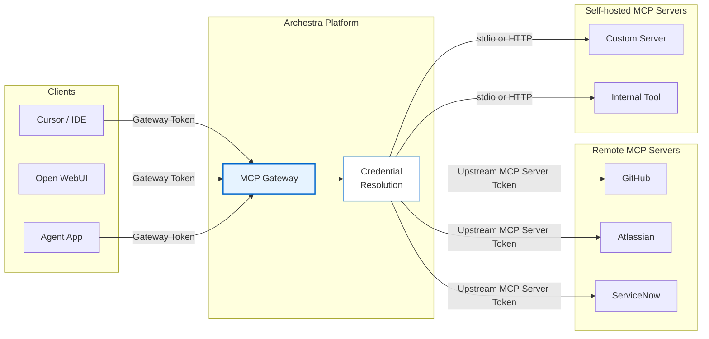

MCP Gateways are the MCP endpoints you expose to clients such as Cursor, Claude Desktop, Open WebUI, and custom agents. Each gateway presents a curated set of tools through one MCP endpoint, so clients do not need to connect to every MCP server directly. Use separate gateways when different clients, teams, or environments need different tool sets or authentication rules — for example, one gateway for developer tools scoped to an engineering team, and another for support tools used by a customer operations agent.

## Gateway Model

A gateway is a named MCP surface with its own visibility, authentication settings, and assigned tools. The same installed MCP server can appear behind multiple gateways, but each gateway independently controls which clients can reach it and which tools are exposed.

Create or edit gateways from **MCPs > Gateways**. A usable gateway requires:

- At least one assigned tool
- A supported client authentication path
- Visibility that matches the users or teams that should call it

After the gateway is configured, use **Connect** to copy connection details for supported clients.

## Creating a Gateway

<Steps>
  <Step title="Open the Gateway Dialog">
    Navigate to **MCPs > Gateways** and click **New Gateway**. Give the gateway a name and set its visibility scope (personal, team, or org).
  </Step>
  <Step title="Assign Tools">
    Add tool assignments from installed MCP server connections. Each assignment can be pinned to a specific installed connection or set to **Resolve at call time** to use the caller's own credential.
  </Step>
  <Step title="Configure Authentication">
    Choose the client authentication method — OAuth 2.1, ID-JAG, Identity Provider JWKS, or Bearer Token. See the [Authentication](#authentication) section below for details on each path.
  </Step>
  <Step title="Connect Clients">
    Use the **Connect** button to copy the gateway endpoint URL and connection instructions for your client.
  </Step>
</Steps>

## Tool Assignment

Each gateway tool assignment is explicit — an admin picks every tool the gateway exposes. Assignments can be:

- **Pinned to a specific installed connection** — useful when a gateway should always use a shared service-account credential for a tool, or when different clients need different subsets of the same server.
- **Resolve at call time** — useful when the gateway should use the caller's own GitHub, Jira, or other upstream credential instead of a shared connection.

<Note>
  If a gateway is scoped to one team, members outside that team cannot use it even if the underlying MCP server exists in the registry. This lets admins approve MCP servers centrally while still exposing different tool sets to different teams or clients.
</Note>

## Authentication

Gateway authentication and upstream MCP server authentication are separate concerns. The client authenticates to Archestra first. When a tool runs, Archestra resolves the credential needed by that specific upstream MCP server.

MCP Gateways support four client authentication paths:

<Tabs>
  <Tab title="OAuth 2.1">
    MCP-native clients such as Claude Desktop, Cursor, Copilot CLI, and Open WebUI authenticate automatically using the [MCP Authorization spec](https://modelcontextprotocol.io/specification/2025-11-25/basic/authorization). The gateway acts as both the resource server and the authorization server.

    Supported flows and registration methods:
    - **Authorization Code + PKCE** — standard browser-based flow with user consent
    - **DCR (RFC 7591)** — clients register dynamically by posting metadata to `POST /api/auth/oauth2/register`
    - **CIMD** — clients use an HTTPS URL as their `client_id`; the gateway fetches the client metadata document without a separate registration step

    Standard well-known endpoints are exposed automatically for client discovery:
    - `/.well-known/oauth-protected-resource`
    - `/.well-known/oauth-authorization-server`

    Use OAuth 2.1 for standard MCP clients.
  </Tab>
  <Tab title="ID-JAG">
    Enterprise-managed MCP clients exchange an identity assertion JWT for an Archestra-issued MCP access token scoped to the gateway. This implements the MCP [Enterprise-Managed Authorization](https://modelcontextprotocol.io/extensions/auth/enterprise-managed-authorization) extension.

    The flow:
    1. User signs in to the MCP client with the enterprise IdP
    2. MCP client exchanges that identity assertion for an ID-JAG
    3. MCP client sends the ID-JAG to `POST /api/auth/oauth2/token` with `grant_type=urn:ietf:params:oauth:grant-type:jwt-bearer`
    4. Archestra validates the ID-JAG and returns an MCP access token
    5. MCP client calls the gateway with that access token

    Requirements:
    - The gateway must be linked to an **OIDC** Identity Provider
    - The ID-JAG must be a JWT with header `typ=oauth-id-jag+jwt`
    - The ID-JAG `aud` claim must match Archestra's OAuth issuer
    - The ID-JAG `resource` claim must point to the target gateway URL

    Use ID-JAG for enterprise-managed identity with token exchange.
  </Tab>
  <Tab title="JWKS">
    Clients send an external IdP JWT directly to the gateway. Archestra validates it against the IdP's JWKS endpoint and matches the caller to an Archestra user account.

    Requirements:
    - The Identity Provider must be an **OIDC** provider with a standard discovery endpoint
    - The JWT `iss` claim must match the IdP's issuer URL
    - The JWT `aud` claim must match the IdP's client ID (if configured)
    - The JWT must contain an `email` claim matching an existing Archestra user

    After authentication, if the upstream server has its own credentials configured, those are used. If no upstream credentials are configured, the gateway propagates the original JWT as `Authorization: Bearer` for end-to-end identity propagation.

    Use JWKS for direct JWT validation without a token exchange step.
  </Tab>
  <Tab title="Bearer Token">
    Direct integrations send `Authorization: Bearer arch_<token>`. Tokens can be scoped to a user, team, or organization and are managed in **Settings > Tokens**.

    For per-user access to downstream systems like GitHub or Jira, use **personal user tokens**. Team and organization tokens can authenticate to the gateway but do not identify a specific user strongly enough for Archestra to broker per-user downstream credentials.

    Use bearer tokens for direct service integrations or simple local setup.
  </Tab>
</Tabs>

<Tip>
  See [MCP Authentication](/mcp/authentication) for the complete gateway and upstream credential model, including enterprise IdP token exchange and dynamic credential resolution.
</Tip>

## Load Tools When Needed

By default, a gateway exposes every assigned tool through MCP `tools/list`. For larger toolsets, enable **Load tools when needed** in the gateway dialog. This keeps the initial tool list small by surfacing only two built-in tools first:

- **`search_tools`** — discovers assigned tools by natural-language query
- **`run_tool`** — dispatches to any tool available to the gateway, including third-party MCP tools

The rest of the gateway's assigned tools remain available on demand: `search_tools` can discover them and `run_tool` can execute them.

<Warning>
  Tool call policies still apply to the target tool. `run_tool` does not bypass input conditions, team conditions, untrusted-context rules, or approval-required rules.
</Warning>

## Connecting Clients

Use the **Connect** button on the gateway to get the endpoint URL and transport-specific instructions for your client. Both SSE and StreamableHTTP transports are supported.

<Tabs>
  <Tab title="Claude Desktop">
    Add the gateway to your `claude_desktop_config.json` using the connection details from the **Connect** dialog. Claude Desktop supports OAuth 2.1 and will prompt for authorization automatically.
  </Tab>
  <Tab title="Cursor">
    Add the gateway URL in **Cursor > Settings > MCP**. Cursor supports OAuth 2.1 via the MCP Authorization spec.
  </Tab>
  <Tab title="Open WebUI">
    Add the gateway URL in the Open WebUI tools configuration. Open WebUI supports both OAuth 2.1 and bearer token authentication.
  </Tab>
  <Tab title="Custom Agents">
    Call `POST /v1/mcp/<gateway-id>` with your bearer token or OAuth access token. The gateway endpoint accepts both SSE and StreamableHTTP transports.
  </Tab>
</Tabs>

## Custom Header Passthrough

MCP Gateways can forward selected client request headers to downstream HTTP-based MCP servers. This is useful for request-specific context such as correlation IDs, tenant IDs, or application headers that need to reach the server handling the tool call.

Configure the allowlist in the gateway's **Advanced** section. Only headers on the allowlist are forwarded; all others are dropped. Header names are case-insensitive and stored in lowercase.

<Warning>
  Gateway header passthrough does not override credentials managed by Archestra. If a forwarded header conflicts with an upstream credential header such as `Authorization`, the credential resolved by Archestra takes precedence. Stdio-based servers do not support HTTP headers.
</Warning>
