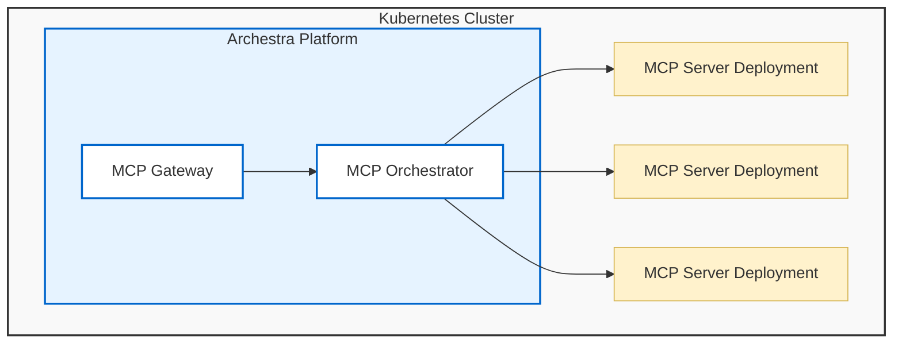

The MCP Orchestrator runs self-hosted MCP servers inside your Kubernetes cluster. It creates the deployment, injects configuration and secrets, exposes logs and status in Archestra, and connects those servers to Agents and MCP Gateways. The orchestrator is only needed for MCP servers that Archestra hosts — remote MCP servers can still be managed in the Private MCP Registry and exposed through MCP Gateways without any Kubernetes deployments.



## Runtime Model

Each self-hosted MCP server runs as its own Kubernetes deployment. That gives every server an isolated process, restart lifecycle, environment, image, and network boundary. When a server is installed from the registry, Archestra creates or updates the deployment for that installation. Gateway traffic is routed to the correct deployment when a tool assigned from that installation runs.

The orchestrator also surfaces server status, container logs, and restart controls so operators do not need to leave Archestra for common MCP runtime tasks.

## How to Use the Orchestrator

<Steps>
  <Step title="Create a Self-Hosted Registry Entry">
    In **MCPs > Registry**, create a new registry entry and set the server type to **Self-hosted**. Define the Docker image or command, transport type, environment variables, and any install-time fields users must provide.
  </Step>
  <Step title="Install the Entry">
    Install the entry for a user or team. Archestra creates the Kubernetes deployment, injects configuration and secrets, and begins polling the server's `tools/list` endpoint.
  </Step>
  <Step title="Monitor Status and Logs">
    Open the installed server in **MCPs > Servers**. The orchestrator surfaces the deployment status, container logs, and restart controls directly in the Archestra UI.
  </Step>
  <Step title="Assign Tools to Agents or Gateways">
    Once tools are discovered, assign them to an Agent or MCP Gateway. When a tool call arrives, the gateway routes it to the correct self-hosted deployment.
  </Step>
</Steps>

## Server Configuration

Self-hosted registry entries define how the Kubernetes deployment should be built.

<CardGroup cols={2}>
  <Card title="Base Image + Command" icon="terminal">
    Use Archestra's MCP server base image and specify the command and arguments to run. Suitable for standard MCP server packages.
  </Card>
  <Card title="Custom Docker Image" icon="docker">
    Provide your own Docker image when the server is already packaged as a container. Combine with image pull secrets for private registries.
  </Card>
  <Card title="Environment and Secrets" icon="shield">
    Define static environment variables, install-time fields, and secret values. Secrets are stored in the Archestra secrets backend and injected at deployment time.
  </Card>
  <Card title="Advanced Deployment YAML" icon="code">
    Override the generated Kubernetes deployment spec when you need custom pod configuration such as resource requests, affinity rules, or additional volumes.
  </Card>
</CardGroup>

<Note>
  Registry entries define whether a server is remote or self-hosted before the orchestrator creates any Kubernetes resources. See [Private MCP Registry](/mcp/private-registry#server-configuration) for the full set of registry fields.
</Note>

## Transports

Self-hosted servers support two transports. Choose based on how your server processes requests.

<Tabs>
  <Tab title="stdio (Default)">
    Archestra runs the server process and communicates over standard input/output. This is the default for most local MCP servers and requires no additional networking configuration.

    ```text
    Archestra orchestrator process → stdin/stdout → MCP server process
    ```

    **Best for**: process-oriented servers, simple command-based servers, servers that do not need per-request HTTP headers.

    <Warning>
      Stdio servers do not support HTTP headers. Gateway header passthrough and per-request credential injection via HTTP are not available for stdio servers.
    </Warning>
  </Tab>
  <Tab title="streamable-http">
    Archestra exposes the server through an internal Kubernetes service and communicates over HTTP. Use this when the server behaves like a normal HTTP service or needs request-specific identity.

    ```text
    Archestra orchestrator → Kubernetes Service → MCP server HTTP endpoint
    ```

    **Best for**: servers that need concurrent requests, downstream HTTP headers, or per-request credential injection from dynamic credential resolution.
  </Tab>
</Tabs>

## Image Pull Secrets

If a custom MCP server image is stored in a private container registry, configure image pull secrets so Kubernetes can authenticate when pulling it. Archestra supports two patterns:

<Tabs>
  <Tab title="Existing Kubernetes Secret">
    Select a pre-existing `kubernetes.io/dockerconfigjson` secret from the Archestra platform namespace. Use this when your organization already manages registry credentials as Kubernetes secrets.
  </Tab>
  <Tab title="Provided Registry Credentials">
    Enter the registry server, username, and password directly in the registry entry. Archestra creates the Docker registry secret in the cluster. Multiple image pull secrets can be configured for one server.
  </Tab>
</Tabs>

## Scheduling Defaults

If `tolerations` or `nodeSelector` values are configured in the Helm values for the Archestra platform pod, those values are automatically inherited as defaults by all self-hosted MCP server deployments. This ensures MCP servers are scheduled on the same node pool as the platform without additional configuration.

These defaults can be overridden per-server via the advanced YAML config. See the [Deployment guide](/deployment) for the relevant Helm values and ingress configuration.

## Credentials and Secret Injection

The orchestrator injects the configuration and secrets required by self-hosted MCP servers. These values come from the installed server connection, not from the MCP client.

- **stdio servers** — credentials are typically provided as environment variables or secrets mounted into the deployment.
- **streamable-http servers** — Archestra can also inject request-specific HTTP credentials when the tool assignment uses dynamic credential resolution.

<Tip>
  See [MCP Authentication](/mcp/authentication#upstream-mcp-server-authentication) for credential resolution, OAuth auto-refresh, and enterprise IdP token exchange.
</Tip>

## Server Lifecycle Management

The orchestrator provides full lifecycle management for self-hosted servers directly from the Archestra UI.

| Action | Description |
|---|---|
| **Status** | Shows the current deployment health — running, pending, error, or restarting. |
| **Logs** | Streams recent container logs without requiring `kubectl` access. |
| **Restart** | Triggers a pod restart for the deployment. |
| **Update** | Updating the registry entry or reinstalling pushes a new deployment revision. |
| **Delete** | Uninstalling the server removes the Kubernetes deployment and cleans up secrets. |
