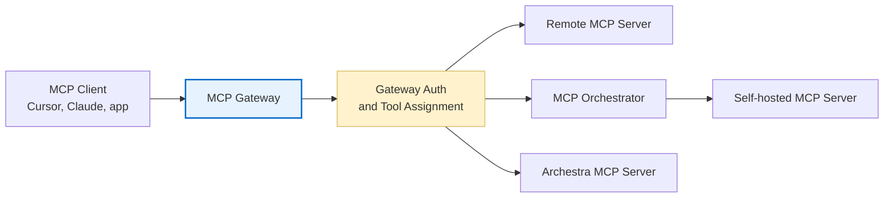

MCP is Archestra's tool layer. It lets agents and external MCP clients use tools from remote MCP servers, self-hosted MCP servers, and built-in Archestra tools through one governed control plane. Every tool call is routed, authenticated, and observed by Archestra regardless of where the backing server actually runs.

## Architecture

The diagram below shows how a client request travels from an MCP client through to the server that handles the tool call. The gateway is the stable endpoint clients connect to. The registry and orchestrator decide where tools come from. Authentication decides who can call the gateway and which upstream credential is used when a tool runs.

## The Five Main Pieces

<CardGroup cols={2}>
  <Card title="Private Registry" icon="book" href="/mcp/private-registry">
    The catalog where teams define which MCP servers can be installed, how they are configured, and which credentials they require. Registry entries are reusable templates; installations are the actual connections created from those templates.
  </Card>
  <Card title="MCP Gateway" icon="door-open" href="/mcp/gateway">
    The client-facing endpoint for Cursor, Claude Desktop, Open WebUI, and custom agents. Each gateway presents a curated set of tools through one MCP endpoint so clients never need to connect to individual servers directly.
  </Card>
  <Card title="MCP Orchestrator" icon="server" href="/mcp/orchestrator">
    The runtime for self-hosted MCP servers. It creates isolated Kubernetes deployments, manages the server lifecycle, and routes gateway traffic to the correct local server.
  </Card>
  <Card title="Authentication" icon="lock" href="/mcp/authentication">
    The gateway and upstream credential model. Clients authenticate to Archestra once; Archestra resolves the credential needed by each upstream MCP server at tool-call time.
  </Card>
  <Card title="Archestra MCP Server" icon="sparkles" href="/mcp/authentication#archestra-mcp-server-tools">
    Built-in tools for managing platform resources such as agents, MCP gateways, registry entries, policies, and limits. Ships with the platform and requires no installation.
  </Card>
</CardGroup>

## Server Runtimes

Archestra supports two server runtimes, and both can be assigned to the same Agent or MCP Gateway. The client does not need to know which runtime backs each tool.

<Tabs>
  <Tab title="Remote Servers">
    Remote MCP servers run outside Archestra and are reached over HTTP. Use them when the server is already hosted by a provider or another internal team. The registry entry stores the server URL, optional docs URL, authentication configuration, and any install-time fields users must fill in.

    Some remote MCP servers expose resources through `resources/list` instead of callable tools through `tools/list`. When a remote server has resources but no tools, Archestra creates read-resource tools during installation so agents can access those resources through the normal tool assignment flow.
  </Tab>
  <Tab title="Self-Hosted Servers">
    Self-hosted MCP servers run inside your Kubernetes cluster through the MCP Orchestrator. Use them when you want isolation, lifecycle management, local network access, or a custom server image.

    Self-hosted servers support two transports:
    - **stdio** — the default. Archestra runs the server process and communicates over standard input/output.
    - **streamable-http** — runs the server as an HTTP service inside the cluster, suitable for servers that need concurrent requests or per-request credential injection.
  </Tab>
</Tabs>

## Authentication Model

MCP access has two independent layers that are resolved separately at call time.

<CardGroup cols={2}>
  <Card title="Gateway Authentication" icon="shield-check">
    Controls whether the client can call the MCP Gateway. Supported paths include **OAuth 2.1**, **ID-JAG**, external IdP JWT validation through **JWKS**, and static **Archestra bearer tokens**.
  </Card>
  <Card title="Upstream Server Authentication" icon="key">
    Controls how Archestra authenticates to the MCP server or external SaaS API behind the tool. Credentials can be static, OAuth-based, dynamically resolved per caller, exchanged through an enterprise IdP, or forwarded as a JWT for upstream JWKS validation.
  </Card>
</CardGroup>

<Note>
  The MCP client only ever sends the gateway-facing token. Archestra resolves upstream credentials behind the scenes using the caller identity, the tool assignment, and the installed server credential configuration.
</Note>

## Archestra MCP Server

The Archestra MCP Server is a built-in server that ships with the platform and requires no installation. It exposes tools for managing platform resources such as agents, MCP gateways, registry entries, policies, and limits. All Archestra tools are prefixed with `archestra__` and are always trusted — they bypass tool invocation and trusted data policies, though RBAC is still enforced.

Two tools are available on every gateway when **Load tools when needed** mode is enabled:

- **`search_tools`** — searches available tools on demand using a natural-language query.
- **`run_tool`** — dispatches to any tool available to the agent or gateway, including third-party MCP tools.

`query_knowledge_sources` is automatically assigned to Agents and MCP Gateways that have at least one knowledge base or knowledge connector attached.

## Observability

Archestra records MCP tool usage so teams can monitor which tools are being called, which servers handle them, and whether calls succeed or fail.

<CardGroup cols={2}>
  <Card title="MCP Metrics" icon="chart-bar">
    Prometheus metrics for tool call volume, error rates, and server-level aggregations. See the Observability docs for metric names and labels.
  </Card>
  <Card title="MCP Tool Call Spans" icon="magnifying-glass">
    Distributed trace spans for individual tool calls, including server routing, credential resolution, and upstream latency.
  </Card>
</CardGroup>
