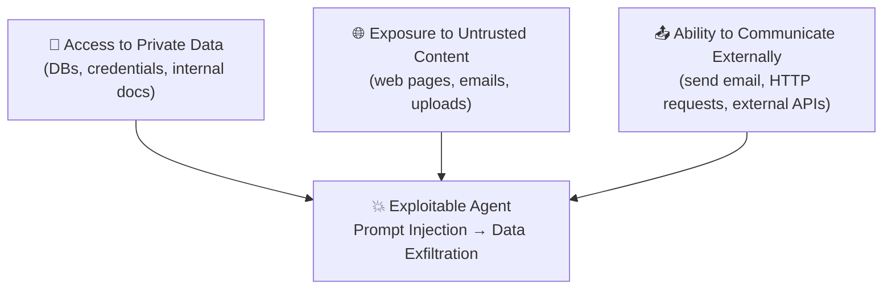

Most platforms try to make agents safer by writing better prompts or by asking another LLM "is this safe?" at runtime. Both approaches fail under prompt injection, because the model itself is the thing being attacked. Archestra takes a fundamentally different approach: security is enforced **at the LLM Proxy**, before a request reaches the model and before a tool call leaves the gateway. Decisions are deterministic, auditable, and depend on the **live context of the conversation** — not a static allowlist.

## Core Security Properties

Archestra's enforcement layer gives you three properties that most agentic stacks do not have.

<CardGroup cols={3}>
  <Card title="Context-Aware Enforcement" icon="shield-check">
    The same tool can be allowed in one turn and blocked in the next, based on what data has already entered the context. After an agent reads an email from outside your domain, `send_email` to external recipients can automatically require approval — without any change to the agent itself.
  </Card>
  <Card title="Sensitive Context Quarantine" icon="lock">
    Untrusted tool output (web pages, emails, issue trackers) is quarantined before it reaches the agent's tool-calling loop. A prompt injection hidden in a fetched page cannot instruct the agent to exfiltrate secrets, because the injected instructions never enter the agent that holds the tools.
  </Card>
  <Card title="Deterministic by Default" icon="sliders">
    Allow/block decisions come from stored policies you can read and audit. An LLM is used to *propose* sensible defaults from tool metadata, not to make the final security call at runtime.
  </Card>
</CardGroup>

## The Threat Model: Lethal Trifecta

Understanding *what* you are defending against is the starting point for the security model. The **Lethal Trifecta**, a concept popularized by security researcher Simon Willison, describes a critical vulnerability pattern that emerges when an AI agent combines three specific capabilities simultaneously.

When all three capabilities are present together, an attacker can embed malicious instructions in content the agent reads — a webpage, an email, a document — and trick the agent into accessing private data and sending it outward. The LLM cannot reliably distinguish between legitimate instructions and injected commands because it processes all input as a continuous token stream with no inherent trust boundaries.

<Note>
  Prompt engineering alone cannot fix the Lethal Trifecta. The model itself is the attack surface. Archestra's controls sit outside the model at the proxy and quarantine layers.
</Note>

### Breaking the Trifecta

The most direct mitigation is to ensure the agent only ever has access to two of the three capabilities. When that is not possible — because you need a capable, general-purpose agent — Archestra's guardrails can dynamically tighten which of the three legs are available depending on live context.

| Option | Private Data | Untrusted Content | External Comms | Result |
|---|---|---|---|---|
| Read-Only System | ✅ | ✅ | ❌ | Safe |
| Isolated Processor | ❌ | ✅ | ✅ | Safe |
| Trusted-Only System | ✅ | ❌ | ✅ | Safe |
| Guardrails (Dynamic) | ✅ | ✅ | Context-Dependent | Safe |

## Attack Flow

The four-step attack that the Lethal Trifecta enables looks like this:

<Steps>
  <Step title="Injection">
    Malicious instructions are embedded in seemingly innocent content — a webpage summary, an email body, or a third-party API response.
  </Step>
  <Step title="Confusion">
    The LLM cannot reliably distinguish between legitimate instructions and injected commands because all input is processed as a single token stream.
  </Step>
  <Step title="Execution">
    The model follows the malicious instructions, accessing private data such as API keys, database contents, or user records.
  </Step>
  <Step title="Exfiltration">
    The compromised agent sends sensitive data to the attacker via email, HTTP, or another external channel it was authorized to use.
  </Step>
</Steps>

## Security Layers in Archestra

Archestra addresses the Lethal Trifecta through three interlocking mechanisms. Read them in order — the trifecta explains *what* you are defending against; guardrails are the *primary* control plane; the configuration agent and Dual LLM are supporting mechanisms that make the primary control plane practical at scale.

<CardGroup cols={2}>
  <Card title="AI Tool Guardrails" icon="shield" href="/security/tool-guardrails">
    The enforcement layer. Tool call policies and tool result policies inspect actual arguments and returned data, then decide whether a call runs and how the result is treated. Evaluated against the running context, not a static list.
  </Card>
  <Card title="Dual LLM Agent" icon="arrows-split-up-and-left" href="/security/dual-llm">
    The quarantine layer. Untrusted tool output is routed through an isolated model with no tool access. The main agent only ever sees a constrained, structured answer — injected instructions cannot reach the tool-calling loop.
  </Card>
  <Card title="Tool Policy Configuration Agent" icon="robot" href="/security/tool-guardrails#policy-configuration-agent">
    The bootstrap. A built-in agent that reads tool metadata and proposes default call and result policies so you do not start from a blank screen for every new tool.
  </Card>
  <Card title="Secrets Management" icon="key" href="/security/secrets-management">
    Sensitive credentials are encrypted at rest in the database or stored externally in HashiCorp Vault — never exposed in prompts or agent context.
  </Card>
</CardGroup>

## References

- [The Lethal Trifecta](https://simonwillison.net/2025/Jun/16/the-lethal-trifecta/) — Simon Willison
- [OWASP Top 10 for LLM Applications](https://owasp.org/www-project-top-10-for-large-language-model-applications/)
- [Dual LLM Pattern](https://archestra.ai/blog/dual-llm) — Archestra Blog
