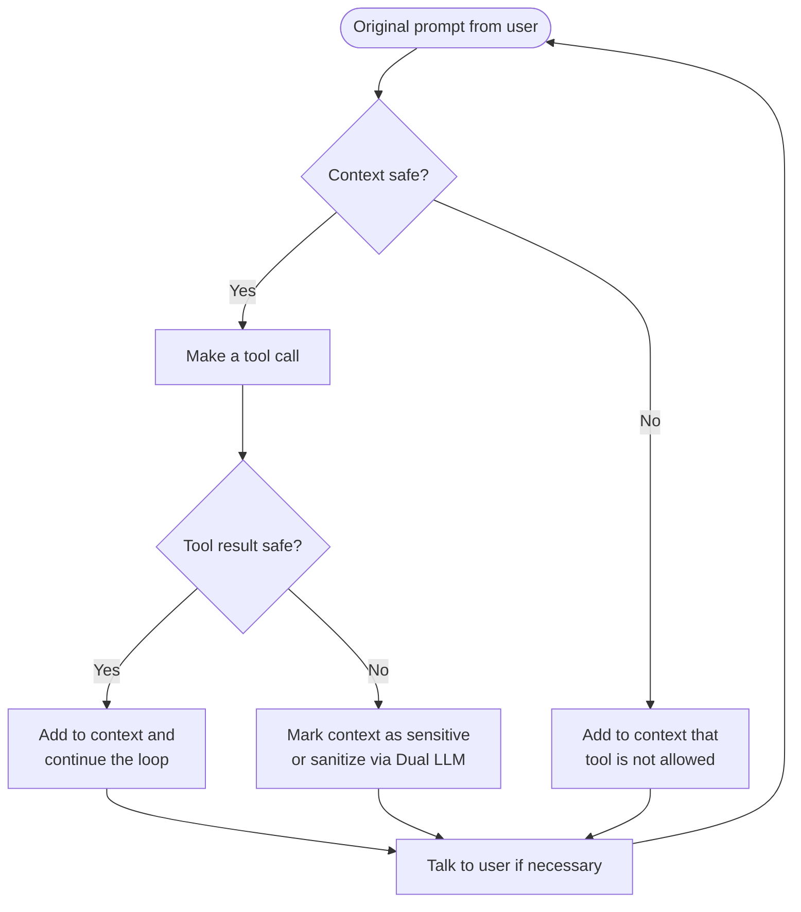

AI tool guardrails address the [Lethal Trifecta](/security/overview#the-threat-model-lethal-trifecta) by enforcing deterministic rules around tool use and tool outputs. Agents can still read sensitive internal data and process untrusted content, but Archestra can dynamically block risky follow-up actions when the context is no longer safe. This gives you a middle ground between a fully permissive agent that can read and send anything, and a permanently read-only agent that can never take external action — the same agent can operate normally in safe contexts and become more restricted only when context or tool output requires it.

## How Context Flows Through Guardrails

Every tool call passes through a context evaluation before it runs, and every tool result is classified before it re-enters the agent loop. The flowchart below shows the full decision path.



<Note>
  Context sensitivity is cumulative. Once a tool result marks the context as sensitive, that state persists for all subsequent tool call evaluations within the same conversation — including calls made by subagents that inherit the parent's context.
</Note>

## Tool Discovery

Archestra discovers tools in two ways, and both feed the same guardrails configuration view.

<CardGroup cols={2}>
  <Card title="LLM Proxy Discovery" icon="radar">
    When requests flow through the LLM Proxy, Archestra records the tool definitions included in those requests. Any tool your agents declare in their system prompts is automatically surfaced here.
  </Card>
  <Card title="MCP Tool Discovery" icon="server">
    When tools belong to MCP servers managed by the Archestra MCP Orchestrator, Archestra already knows those tool definitions and surfaces them in the same guardrails view — no additional configuration needed.
  </Card>
</CardGroup>

This gives you one control plane for tools discovered from live agent traffic and tools hosted by MCP infrastructure that Archestra orchestrates directly.

## Tool Call Policies

Tool call policies control whether a tool may run in the current context. Archestra evaluates the policy against the actual arguments submitted to the tool call, not just the tool name.

<Tabs>
  <Tab title="Allow Always">
    The tool can run even when the current context is marked sensitive or untrusted. Use this for safe internal read paths where the tool itself cannot cause harm regardless of what the context contains.
  </Tab>
  <Tab title="Allow in Safe Context">
    The tool can run only while the current context is still safe. As soon as any tool result marks the context as sensitive, this tool becomes unavailable until the conversation resets.
  </Tab>
  <Tab title="Require Approval">
    The tool requires explicit user approval in the chat interface before it executes. In autonomous or headless execution contexts where no user is present to approve, the call is blocked automatically.
  </Tab>
  <Tab title="Block Always">
    The tool is never allowed to run automatically, regardless of context state. Use this for tools with irreversible side effects that must always go through an out-of-band approval process.
  </Tab>
</Tabs>

### Example: Scoping `send_email` by Recipient Domain

A `send_email` tool may be acceptable for internal recipients but must require approval for external ones. The policy inspects the actual `to` argument before the call runs:

```json
{
  "tool": "send_email",
  "conditions": [
    {
      "field": "to[*]",
      "operator": "all_match",
      "pattern": "@mycompany\\.com$",
      "action": "allow_always"
    },
    {
      "field": "to[*]",
      "operator": "any_not_match",
      "pattern": "@mycompany\\.com$",
      "action": "require_approval"
    }
  ]
}
```

This makes the policy decision depend on the actual attempted action, not just on the name of the tool.

## Tool Result Policies

Tool result policies control how tool output is treated after a tool runs. Use them when the tool itself may be safe to call, but the returned data could be sensitive, adversarial, or prompt-injectable.

<CardGroup cols={2}>
  <Card title="Safe" icon="circle-check">
    The result is considered safe and continues through the agent loop normally. Context state is unchanged.
  </Card>
  <Card title="Sensitive" icon="triangle-exclamation">
    The result is treated as sensitive or risky context for later decisions. Subsequent tool call policies that require a safe context will be denied.
  </Card>
  <Card title="Dual LLM" icon="arrows-split-up-and-left">
    The result is routed through the [Dual LLM Agent](/security/dual-llm) before it is returned to the main agent. The main agent only sees a constrained, safe summary — never the raw output.
  </Card>
  <Card title="Blocked" icon="ban">
    The result is blocked entirely and never enters the agent's context. The tool call appears to have returned nothing.
  </Card>
</CardGroup>

### Example: Classifying Emails by Sender Domain

A `read_email` tool may be safe to call, but returned messages from external senders could contain prompt injections. The policy inspects the result and classifies it:

```json
{
  "tool": "read_email",
  "result_conditions": [
    {
      "field": "emails[*].from",
      "operator": "all_match",
      "pattern": "@mycompany\\.com$",
      "action": "safe"
    },
    {
      "field": "emails[*].from",
      "operator": "any_not_match",
      "pattern": "@mycompany\\.com$",
      "action": "sensitive"
    }
  ]
}
```

This lets the agent continue normally when it is only reading internal mail, while automatically tightening later tool use after reading email from outside your company.

## Policy Evaluation Order

Archestra evaluates policies in the order they are defined. The first matching condition determines the action taken. Policies can also be scoped to specific agents — for example, allowing an internal support agent to use `send_email` for `@mycompany.com` recipients while keeping the same tool blocked for a broader research agent.

<Warning>
  Subagent delegation does not reset trust state. If a parent agent delegates to a subagent after the conversation has already become sensitive, the subagent inherits that unsafe context and the same tool call restrictions continue to apply.
</Warning>

## Deterministic vs. LLM Guardrails

Many platforms use probabilistic LLM guardrails that ask a model to decide whether content or actions are allowed. Archestra's AI tool guardrails are different:

| Property | Archestra Guardrails | LLM Guardrails |
|---|---|---|
| Decision source | Stored policies | Model judgment at runtime |
| Determinism | ✅ Fully deterministic | ❌ Probabilistic |
| Context-aware | ✅ Evaluates live context | ❌ Usually stateless |
| Auditable | ✅ Inspect exact policies applied | ❌ Opaque model output |
| Composable | ✅ Combine with Dual LLM | Limited |

Use probabilistic LLM guardrails when you want fuzzy classification or moderation. Use deterministic AI tool guardrails when you need predictable enforcement against data exfiltration and unsafe tool chaining.

## Load Tools When Needed

When an agent or MCP Gateway uses **Load tools when needed**, the initial MCP `tools/list` only includes `search_tools` and `run_tool`. Tool call policies are still evaluated against the tool that actually runs.

If `run_tool` is asked to execute `send_email`, Archestra evaluates the `send_email` policies with the submitted `tool_args`, current trust state, and policy context. Input conditions, team conditions, untrusted-context rules, and approval-required rules all work the same way as a direct `send_email` tool call — the indirection through `run_tool` does not bypass guardrails.

## Policy Configuration Agent {#policy-configuration-agent}

Archestra includes a built-in Tool Policy Configuration Agent that analyzes tool metadata and proposes default tool call policies and tool result policies automatically, so you do not start from a blank screen for every new tool.

<Accordion title="How the Policy Configuration Agent Works">
  When triggered, the subagent sends each tool's name, description, MCP server name, parameter schema, and [tool annotations](https://modelcontextprotocol.io/specification/2025-06-18/schema#toolannotations) to an LLM. The LLM returns structured recommendations for both tool call policies and tool result policies, along with reasoning that is stored for auditability.

  The agent can run in two ways:

  - **Automatically on tool discovery.** When enabled, newly discovered tools get default policies without manual review first.
  - **Manually on demand.** Trigger it for specific tools when you want Archestra to propose defaults for an existing tool set.

  In both cases, tools that already have custom policies with conditions are preserved — only default policies are overwritten.
</Accordion>

<Tip>
  The Policy Configuration Agent can recommend the Dual LLM action automatically for tools that read from untrusted sources such as web search, email readers, and document processors. Review its suggestions in the guardrails UI before enabling automatic application in production.
</Tip>

## Configuring Policies in the UI

<Steps>
  <Step title="Open the Guardrails View">
    Navigate to **LLM Proxy → Tool Guardrails** in the Archestra dashboard. All discovered tools appear here, grouped by discovery source (LLM Proxy traffic or MCP server).
  </Step>
  <Step title="Select a Tool">
    Click any tool to open its policy editor. You will see separate sections for **Tool Call Policies** and **Tool Result Policies**.
  </Step>
  <Step title="Add a Condition">
    For each policy, add one or more conditions that inspect arguments (for call policies) or returned fields (for result policies). Select the action to take when the condition matches.
  </Step>
  <Step title="Set the Default Action">
    Define a fallback action that applies when no conditions match. This is typically **Allow in safe context** for call policies and **Safe** or **Sensitive** for result policies.
  </Step>
  <Step title="Save and Test">
    Save the policy. The next agent request that uses this tool will be evaluated against the new rules. Use the audit log to confirm the expected action was taken.
  </Step>
</Steps>
